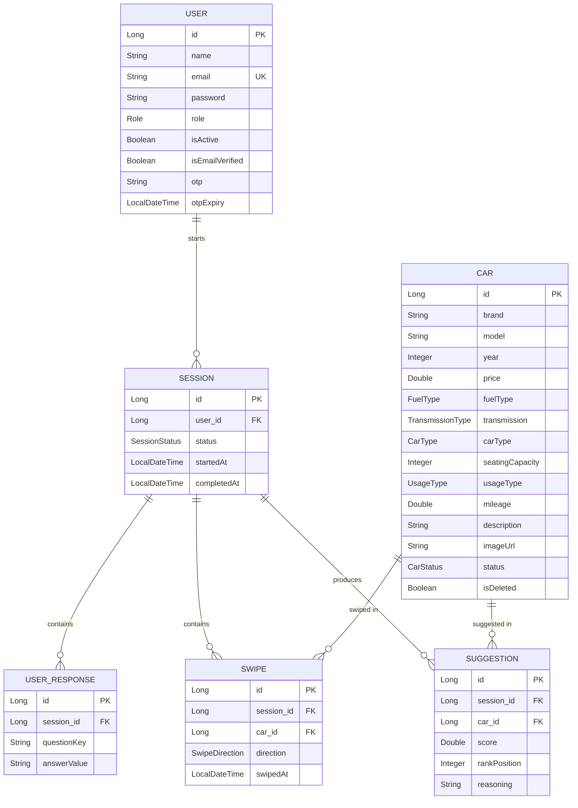

# CarMatch

**AI-Powered Car Recommendation REST API** — a Tinder-style car matching platform for the India market, built with Spring Boot.

Users answer a short questionnaire about their car preferences, swipe LIKE/PASS on car cards, and receive ranked suggestions with human-readable reasoning explaining *why* each car was recommended.

Live deployment:
- **API:** https://carmatch-6bo2.onrender.com
- **Frontend:** https://car-match-test.vercel.app

> Note: the backend is hosted on Render's free tier, which spins down after inactivity. The first request after idle time may take 30-50 seconds to respond.

---

## Tech Stack

| Layer | Technology |
|---|---|
| Language | Java 21 |
| Framework | Spring Boot 3.2.5 |
| Database | MySQL 8 (hosted on Aiven, SSL required) |
| ORM | Spring Data JPA / Hibernate |
| Auth | Spring Security 6 + JWT (jjwt 0.12.3) |
| Email | Brevo HTTP API (OTP verification) |
| Image hosting | Cloudinary |
| API docs | springdoc-openapi (Swagger UI) |
| Testing | JUnit 5 + Mockito |
| Backend hosting | Render (Docker multi-stage build) |
| Frontend | React (single-file app, built via Antigravity AI agent) |
| Frontend hosting | Vercel |

---

## Entity-Relationship Diagram



**Key relationship notes:**
- `Car` has **no direct link to `User`** — cars are only connected to users indirectly, through `Swipe` and `Suggestion` records tied to a `Session`.
- `Swipe` has a unique constraint on `(session_id, car_id)` — a user can't swipe the same car twice in one session (enforced at both the application layer and the database).
- All entities extend `BaseEntity`, which provides `id`, `createdAt`, `updatedAt`, and `isDeleted` (soft delete pattern).

---

## Core Features

- **Auth:** Register/login with JWT, email OTP verification (10-minute expiry), resend OTP, BCrypt password hashing
- **Questionnaire:** 6 fixed preference questions (budget, fuel type, car type, seating, usage, transmission)
- **Swipe sessions:** LIKE/PASS per car, duplicate-swipe protection, auto-completes at 20 swipes
- **Recommendation engine:** Weighted scoring out of 115 points (budget 30, fuel type 25, car type 20, seating 15, usage 10, transmission 10, recency bonus 5)
- **Suggestions:** Top 3 liked cars re-ranked with generated natural-language reasoning
- **Browse/search:** Keyword search, filters (fuel/type/transmission/price/seats), pagination, sorting
- **History:** Past sessions, full session detail (answers + swipes + suggestions), all suggestions across sessions
- **Admin panel:** Car CRUD + approve/reject workflow, user management (list/deactivate/activate), admin-cannot-deactivate-admin safety check
- **Global exception handling:** Consistent `{status, message, data}` response envelope across all endpoints, including validation errors, auth errors, and a generic 500 fallback

---

## Getting Started (Local Development)

1. Clone the repo and copy the properties template:
   ```bash
   cp src/main/resources/application.properties.example src/main/resources/application.properties
   ```
2. Fill in your local MySQL credentials and a JWT secret in `application.properties` (this file is gitignored — never commit real secrets).
3. Run:
   ```bash
   ./mvnw spring-boot:run
   ```
4. API available at `http://localhost:8080`. Swagger UI at `http://localhost:8080/swagger-ui.html`.

---

## API Overview

All endpoints (except `/api/auth/**` and `/api/health`) require a `Bearer <JWT>` header.

| Area | Base path |
|---|---|
| Auth | `/api/auth/*` (register, login, verify-otp, resend-otp) |
| User profile | `/api/users/me` |
| Cars (user) | `/api/cars/*` |
| Cars (admin) | `/api/admin/cars/*` |
| Users (admin) | `/api/admin/users/*` |
| Sessions/questionnaire | `/api/sessions/*` |
| Swipes | `/api/sessions/{id}/swipe` |
| Suggestions | `/api/sessions/{id}/suggestion` |
| Recommendations | `/api/sessions/{id}/recommendations` |
| History | `/api/history/*` |

Full interactive documentation is available via Swagger UI at `/swagger-ui.html`.

---

## Testing

28 unit tests across 5 test classes (JUnit 5 + Mockito), covering `AuthService`, `SessionService`, `SwipeService`, `SuggestionService`, and `RecommendationService` business logic — including edge cases like duplicate swipes, session state transitions, scoring edge cases, and auto-completion at 20 swipes.
